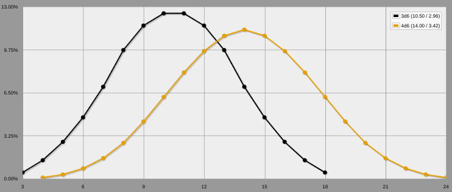
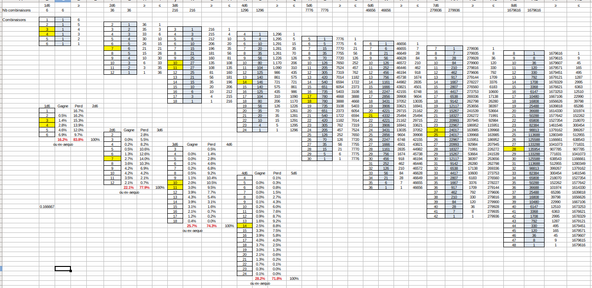
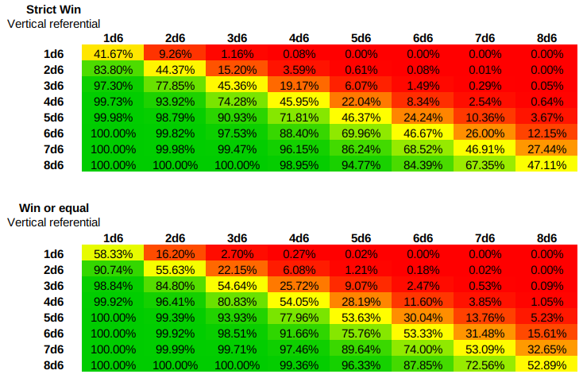
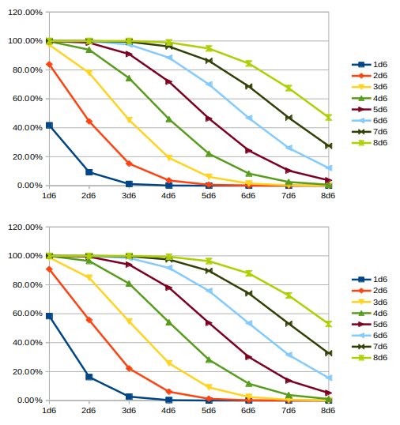

# Analyse des combats dans des systèmes orientés D6

## Contexte

En jouant avec [Risus](https://github.com/orey/jdr-risus), JDR dans lequel les PJs ont un certain nombre de D6 dans un Cliché et font des combats en jetant les dés de leur Clichés en tentant de faire plus que leur adversaire, on peut se poser la question de la probabilité de succès d'un des joueurs ayant un ou plusieurs dés de moins que son adversaire.

En effet, le jet de plusieurs dés donné des courbes en cloche (comme [expliqué ici](https://github.com/orey/jdr/tree/master/D6-System)). Quid donc de *l'intersection* de deux courbes en cloches décalée d'un ou plusieurs dés ?

Intuitivement, la courbe en cloche étant :

1. centrée sur sa moyenne,
2. ayant des parties basses et hautes aux très faibles probabilités,

on peut penser que le décalage d'un seul dé rend le combat statistiquement improbable à gagner.



*(fait avec https://anydice.com)*

La déformation de ces courbes est tellement importante que des seuils élevés sont presque inaccessible pour des PJs ayant beaucoup de dés dans leur "pool".

Pour autant, il ne semble pas simple de trouver sur Internet de vrais calculs de probabilités mettant en scène des joueurs ayant des pools de dés distincts et combattant l'un contre l'autre.

## Premier calcul



L'image ci-dessus montre le premier onglet du tableur LibreOffice [nD6.ods](nD6.ods). Dans ce tableur, les probabilités des différents jets sont proposés et, en dessous, des calculs manuels de probabilité de chance de combat pour divers types de combats.

Comme il n'est pas simple de calculer les probabilités de "8D6" mettons, nous avons fait un petit programme Javascript pour le calculer : proba.js.

```
$ node proba.js
Usage:
> node proba [number] [faces]
'number' and 'faces' must be integers

```

Exemple d'utilisation pour 5d6 :

```
$ node proba.js 5 6
[...]
5,100.00%
6,99.99%
7,99.92%
8,99.73%
9,99.28%
10,98.38%
11,96.76%
12,94.12%
13,90.20%
14,84.80%
15,77.85%
16,69.48%
17,60.03%
18,50.00%
19,39.97%
20,30.52%
21,22.15%
22,15.20%
23,9.80%
24,5.88%
25,3.24%
26,1.62%
27,0.72%
28,0.27%
29,0.08%
30,0.01%
```

Le tableau donné est celui des probabilités de succès du lancer.

## Calculer les probabilités de gagner en combat xd6 contre yd6

La première chose à constater est que les probabilités ne sont pas exactement symétriques entre les deux joueurs. C'est étrange mais c'est normal.

Supposons que le premier joueur ait 3d6 et le second 4d6 : le premier joueur lancera sur un intervalle de 3-18 soit 16 possibilités, alors que le second joueur lancera sur un intervalle de 4-24 soit 21 possibilités.

La méthode prise pour ce calcul est la suivante : il s'agit de regarder tous les scores possible du joueur à xd6 et à calculer ses probabilités de gagner sur un jeu de son adversaire.

Nous allons donc multiplier les probabilité du joueur 1 à xd6 de faire un score `n` avec les probabilités pour le joueur 2 à yd6 de faire "plus" que `n`. Nous avons pris deux options pour le "plus": le plus ou égal et le plus strict.

Pour cela, un second petit programme a été écrit : proba-versus.js.

```
$ node proba-versus.js 
Usage:
> node proba [number1] [faces1] [number2] [faces2]
'number' and 'faces' must be integers

```

Exemple d'utilisation, 3d6 contre 4d6 :

```
$ node proba-versus.js 3 6 4 6
[...]
--- Seen from fighter 1: strict WIN, loose or equal ---
TN = 3 - Win = 0.00% - Loose = 0.46%
TN = 4 - Win = 0.00% - Loose = 1.39%
TN = 5 - Win = 0.00% - Loose = 2.78%
TN = 6 - Win = 0.02% - Loose = 4.61%
TN = 7 - Win = 0.08% - Loose = 6.86%
TN = 8 - Win = 0.26% - Loose = 9.46%
TN = 9 - Win = 0.63% - Loose = 10.95%
TN = 10 - Win = 1.22% - Loose = 11.28%
TN = 11 - Win = 1.99% - Loose = 10.51%
TN = 12 - Win = 2.77% - Loose = 8.81%
TN = 13 - Win = 3.26% - Loose = 6.46%
TN = 14 - Win = 3.08% - Loose = 3.86%
TN = 15 - Win = 2.58% - Loose = 2.05%
TN = 16 - Win = 1.85% - Loose = 0.93%
TN = 17 - Win = 1.06% - Loose = 0.33%
TN = 18 - Win = 0.39% - Loose = 0.07%
WIN = 19.17% - LOOSE = 80.83%
100.00%
--- Seen from fighter 1: win or equal, strict loose ---
TN = 3 - Win = 0.00% - Loose = 0.46%
TN = 4 - Win = 0.00% - Loose = 1.39%
TN = 5 - Win = 0.01% - Loose = 2.77%
TN = 6 - Win = 0.05% - Loose = 4.58%
TN = 7 - Win = 0.19% - Loose = 6.76%
TN = 8 - Win = 0.53% - Loose = 9.20%
TN = 9 - Win = 1.13% - Loose = 10.45%
TN = 10 - Win = 1.99% - Loose = 10.51%
TN = 11 - Win = 2.99% - Loose = 9.51%
TN = 12 - Win = 3.88% - Loose = 7.69%
TN = 13 - Win = 4.31% - Loose = 5.41%
TN = 14 - Win = 3.86% - Loose = 3.08%
TN = 15 - Win = 3.08% - Loose = 1.55%
TN = 16 - Win = 2.11% - Loose = 0.66%
TN = 17 - Win = 1.17% - Loose = 0.22%
TN = 18 - Win = 0.42% - Loose = 0.05%
WIN = 25.72% - LOOSE = 74.28%
100.00%
```

## Synthèse

En synthèse, le tableur LibreOffice [nD6.ods](nD6.ods) propose une vision synthétique des probabilités de réussite de xd6 contre yd6.



Comme nous le voyons, ces probabilités sont fixes. Il faut lire le tableau de la manière suivante : le premier joueur est en colonnes et le tableau indique son pourcentage de chances de gagner contre les différents scores des adversaires (en ligne).



La figure ci-dessus montre les deux mêmes tables en courbes.

On constate par exemple que la chance de gagner de 3d6 contre 4d6 en mode "strict" est de seulement 19%, soit une chance sur 5, et elle est simplement de 6% contre 5d6 !

Tout comme l'écran jeu Risus proposé [ici](https://rouboudou.itch.io) propose un tableau des probabilités de réussite de jets par seuil, il serait aussi intéressant de proposer aux MJs, un tableau de probabilités de réussites en combats.

Cette décroissance très rapide des pourcentages explique les mécanismes de rectification des probabilités que l'on trouver dans certains jeux basés sur des pools de d6 :

* Ghostbusters : la consommation d'un bon point ("brownie point") permet de rajouter un d6 au round de combat ; comme le joueur est supposer posséder de nombreux bon points, il peut compenser durant tout un combat ;
* Risus : mécanisme de la gonflette, moins avantageux pour le joueur car ajoutant des pénalités sur les rounds suivants ;
* Star Wars d6 : à voir.

## Pistes

Il serait bien de comparer la déformation des courbes avec des systèmes linéaires de type pourcentage. Il faudrait tenter de faire un parallèle entre les systèmes pour voir si, au final, les systèmes gèrent aussi bien les disparités entre PJs dans le cadre des systèmes de combat.

