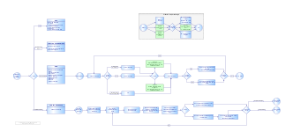

# Règles Risus résumées

## Intro

* Version originale : [Risus the RPG](https://www.drivethrurpg.com/product/170294/Risus-The-Anything-RPG)
* Version française : [Risus, traduction de Tristan Lhomme](risus-fr.pdf)
* Site américain : [risusiverse](http://www.risusiverse.com/)

## V1 du flowchart Risus : création de perso + système de jeu

* 
* Publié sur [itch.io](https://rouboudou.itch.io/risus-flowchart)

Sinon :

* [En PDF](risus-flowchart.pdf)
* [En PNG taille normale](risus-flowchart.png)
* [En PNG taille maxi](risus-flowchart-big.png)

## Création du personnage

**Comment ?**

* 10 D6 à répartir sur des Chichés (entre 3 et 10).

Info :

* Newbie : 1D
* Pro : 3D
* Maître : 6D

**Matériel**

* Inclus quand dans cela reste dans le raisonnable.

**Coup de bol (option)**

* 1 dé permet d'acheter 3 coups de bol (1 coup de bol = +1D sur une seule action).

**Point faible (nommé "Amorce")**

+1D de création si validation du MJ.

**Historique**

S'il est bien, le MJ peut donner +1D.

**Double Gonflette**

Les clichés magiques :

* Coûtent deux fois plus (2D investis = 1D de Cliché) ;
* On peut les double-gonfler en combat : par exemple +2D en combat => -1D sur le Cliché.

## Système de jeu : basé sur la notion de "challenge"

**Facteur de difficulté**

* 5 : facile,
* 10 : défi même pour un pro,
* 15 : défi héroïque,
* 20 : difficulté presque surhumaine,
* 30 : difficulté surhumaine.

## Système de combat : basé sur le système du duel

Exemples de cas d'utilisation

* Débat,
* Courses de chevaux,
* Duel aérien,
* Duels astraux / psychiques,
* Duels magiques,
* Duels de Banjos,
* Séduction,
* Tribunal,
* Combat physique.

Génaralement, l'agresseur détermine le type de combat.

Le round de combat :

* Choisir le cliché ;
* _Gonflette (option validée par le MJ) : +1D au jet = -1D obligatoire sur Cliché à la fin du round_ ;
* Lancer les dés ;
* Le plus petit score perd 1D (ou 3D si le Cliché gagnant est inadapté).

Le premier à zéro sur un Cliché a perdu. Le vainqueur fait ce qu'il veut du gagnant.

On récupère les dés avec de la guérison (contextuelle au type de duel).

Attention :

* Cliché inadapté : le roleplay permet de l'utiliser ;
* -3D si le Cliché inadapté gagne.

 Porte de sortie : 2D par défaut en cas d'absence totale de Cliché adapté.

## Conflit à action unique (trop rapides)

Un seul jet sur le Cliché approprié.

## Groupes

Groupes de PNJ :

* Comme un PNJ avec plus de dés.
  
Groupe de PJ :

* Le Chef de Groupe est celui dont le le Cliché s'applique et qui a le plus de dés.
* Les jets des autres ne comptent en plus du Chef de groupe que s'ils font 6.
* Les Clichés inadaptés ne triplent pas les pertes de dés.
* Si tous les Clichés sont inadaptés et perdent, discuter avec le MJ.
* Si le Groupe perd, le Cliché d'un seul membre est diminué (nommé par le Chef de Groupe). Si quelqu'un veut bien prendre les dommages à sa place, ce quelqu'un perd 2D sur son Chiché mais le Chef de Groupe a le droit de lancer _deux fois plus de dés_ pour la prochaine attaque (bonus de vengeance).

Si quelqu'un sort du Groupe, tous les membres du Groupe perdent un dé et celui qui sort du Groupe, passe à 0 dé. Si le Chef qui part, consulter les règles.

## Expérience

A la fin, jet de Cliché: si tous les dés sont pairs, +1D au cliché (6D max par cliché). Ou nouveau Cliché à 1.

Ce jet peut être fait en cas d'action exceptionnelle.

